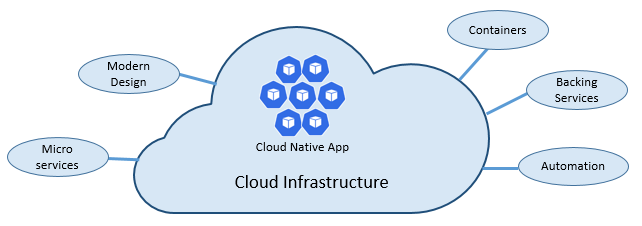
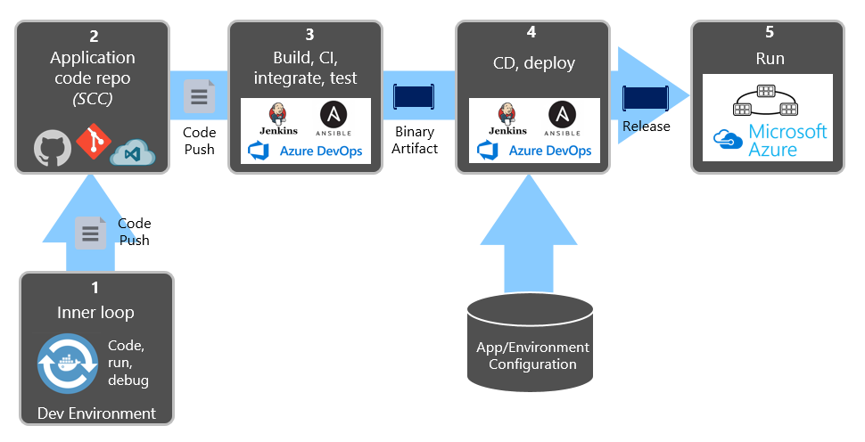

# 什么是云原生？聊聊云原生的"前世今生"

> 什么是云原生，云原生是在一个怎么样的背景下被提出来的，云原生和传统所说的云计算概念有什么不同？

云原生这词在这几年突然火了，在很多人还不了解她是什么的时候频频被她刷屏。所以我经常说技术人是一个容易焦虑的群体，每天被一堆新的概念拉着走，扯着学。新语言多，新概念多，新技术多，没什么安全感。对于新概念，我喜欢从三个层次去理解，一个是这技术名词被提出的历史背景，一个是技术名词概念的演化，一个是结合比较主流的话语体系的解读。关于云原生，我也会从这三个方面来解读。

## 云原生(Cloud Native)的由来

云原生的概念最早开始于2010年，[在当时 Paul Fremantle 的一篇博客中被提及](http://pzf.fremantle.org/2010/05/cloud-native.html)，他主要将其描述为一种和云一样的系统行为的应用的编写，比如分布式的、松散的、自服务的、持续部署与测试的。当时提出云原生是为了能构建一种符合云计算特性的标准来指导云计算应用的编写。

后来到[2013年 Matt Stine在推特上迅速推广云原生概念](https://dzone.com/articles/cloud-native-devops-your-world-to-new-possibilitie)，并[在2015年《迁移到云原生架构》](https://www.oreilly.com/library/view/migrating-to-cloud-native/9781492047605/)一书中定义了符合云原生架构的特征：12因素、微服务、自服务、基于API协作、扛脆弱性。而由于这本书的推广畅销，这也成了很多人对云原生的早期印象，同时这时云原生也被[12要素](https://12factor.net/)变成了一个抽象的概念。

## CNCF基金会成立及云原生概念的演化

2015年由Linux基金会发起了一个 [The Cloud Native Computing Foundation（CNCF） 基金组织](https://www.cncf.io/)，CNCF基金会的成立标志着云原生正式进入高速发展轨道，[google、Cisco、Docker各大厂纷纷加入](https://www.cncf.io/announcement/2015/12/17/cloud-native-computing-foundation-announces-new-members-begins-accepting-technical-contributions/)，并逐步构建出围绕 Cloud Native 的具体工具，而云原生这个的概念也逐渐变得更具体化。因此，CNCF基金最初对云原生定义是也是深窄的，当时把云原生定位为容器化封装+自动化管理+面向微服务：
> The CNCF defines “cloud-native” a little more narrowly, to mean using open source software stack to be containerized, where each part of the app is packaged in its own container, dynamically orchestrated so each part is actively scheduled and managed to optimize resource utilization, and microservices-oriented to increase the overall agility and maintainability of applications.

这主要因为CNCF基金会在当时的核心拳头软件就是 k8s，因此在概念定义上主要是围绕着容器编排建立起来的生态。其实这也是为什么我们可以看到 CNCF 定义云原生的时候有时感觉就是再说容器生态。

到了2017年, 云原生应用的提出者之一的[Pivotal在其官网](https://pivotal.io/cloud-native)上将云原生的定义概况为DevOps、持续交付、微服务、容器这四大特征，这也成了很多人对 Cloud Native的基础印象。

而到了2018年，随着Service Mesh的加入，[CNCF对云原生的定义发生了改变](https://github.com/cncf/toc/blob/master/DEFINITION.md)，而这也逐渐作为被大家认可的官方定义：
> Cloud native technologies empower organizations to build and run scalable applications in modern, dynamic environments such as public, private, and hybrid clouds. Containers, service meshes, microservices, immutable infrastructure, and declarative APIs exemplify this approach.
> These techniques enable loosely coupled systems that are resilient, manageable, and observable. Combined with robust automation, they allow engineers to make high-impact changes frequently and predictably with minimal toil.
> The Cloud Native Computing Foundation seeks to drive adoption of this paradigm by fostering and sustaining an ecosystem of open source, vendor-neutral projects. We democratize state-of-the-art patterns to make these innovations accessible for everyone.

总结一下就是：
- （1）基于容器、服务网格、微服务、不可变基础设施和声明式API构建的可弹性扩展的应用；
- （2）基于自动化技术构建具备高容错性、易管理和便于观察的松耦合系统；
- （3）构建一个统一的开源云技术生态，能和云厂商提供的服务解耦，

可以看出这一阶段CNCF对云原生的定义加上**服务网格**和**声明式API**，同时为这一概念阐述更深一层的意义，也就是建立一个**统一中立的开源云生态**（至于是否中立嘛这里就不谈了:）。这对云原生的生态定位会是很重要的一点，也算CNCF最初成立的宗旨之一吧，打破云巨头的垄断。

## 对云原生的解构

对一个词的解读，除了看其历史发展背景，还有一种偏向于语言学的方法解读，也就是我们常说的从“字面意思”来理解为何这些理念的集合体。

Cloud Native，从词面上拆解其实就是 Cloud 和 Native，也就是*云计算*和*土著*的意思——云计算上的原生居民，即天生具备云计算的亲和力。

那怎么理解“云的原生居民”呢？

首先从云的角度来理解，云本质可以看作是一种提供稳定计算存储资源的对象，为了实现这点，像**虚拟化、弹性扩展、高可用、高容错性、自恢复**这些都是云的基本属性，云原生作为一种云计算，这是所具备的第一层含义。

第二层要从 Native 来看，云原生和传统的在云上跑的应用是不同。比如一些基于公有云搭建的应用，是基于传统的SOA架构来搭建的，然后再移植到云上去运行，那么他和云得整合是非常低得。
为什么低呢？云作为一种**分布式架构**，其“土著居民”也应该是基于分布式架构设计出来得，而**微服务**或者**Serverless**这种将服务或函数拆分成一个个模块的松耦合系统天然就具备分布式设计得属性。这是Native的第一种表现。

其次云作为一种PaaS服务，这位“土著居民”从出生(设计)到成长(开发)，再到生活(部署)都应该是基于云的理念来实现的，那么就需要一套自动化的开发流程**CI/CD**来实现。这是Native的第二种表现。

而最后“土著居民”的特点希望做到能在所有的云端都是适应的，不管是各厂商的公有云 像AWS、Azure、阿里云，还是各企业自己搭建的私有云，云原生的应用都能做到无缝的运行和连接。

## 参考文献
- [Paul Fremantle's Blog](http://pzf.fremantle.org/2010/05/cloud-native.html)
- [Cloud-Native: What It Is and How It All Started](https://dzone.com/articles/cloud-native-devops-your-world-to-new-possibilitie)
- [The Twelve Factor App](https://12factor.net/)
- [Migrating to Cloud Native Application Architectures](https://www.oreilly.com/library/view/migrating-to-cloud-native/9781492047605/)
- [迁移到云原生应用架构](https://github.com/rootsongjc/migrating-to-cloud-native-application-architectures)
- [微软技术文档: 云原生的定义](https://docs.microsoft.com/en-us/dotnet/architecture/cloud-native/definition)