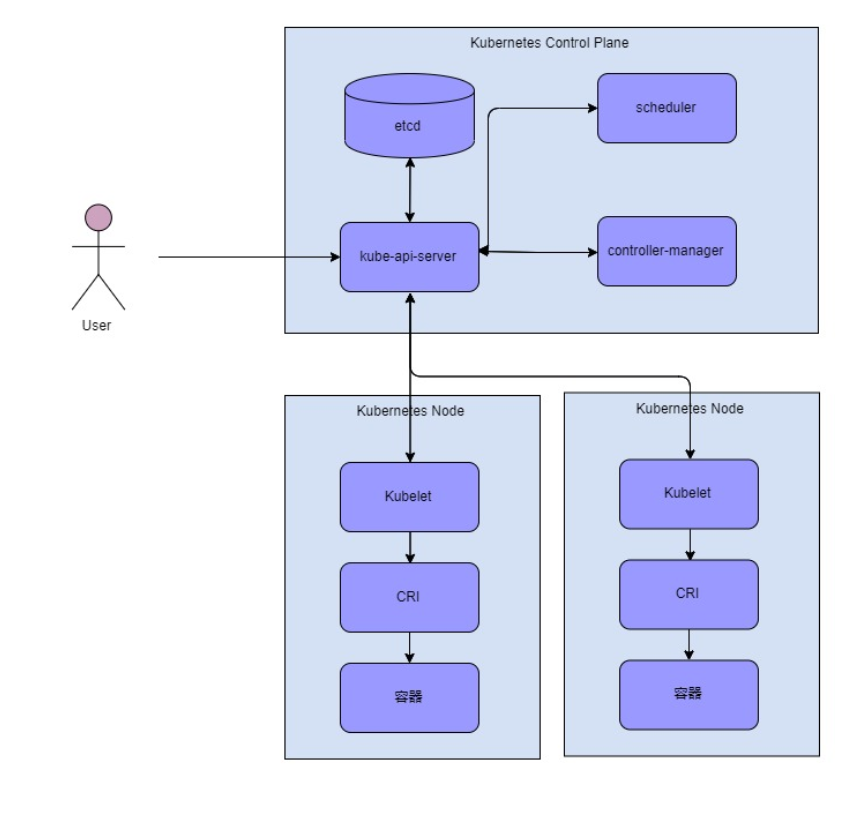
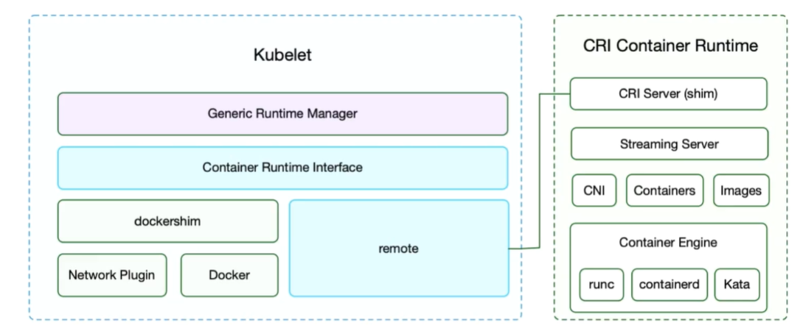
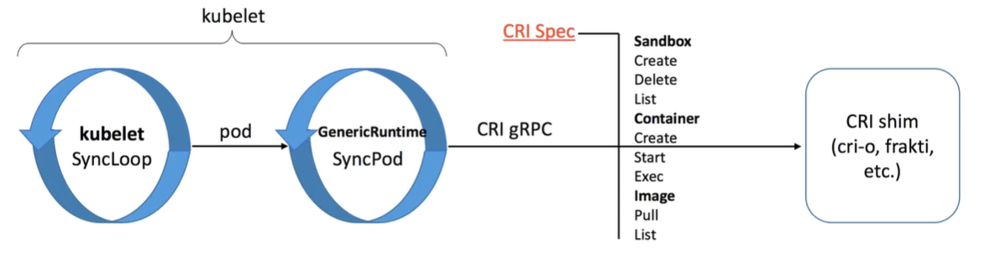
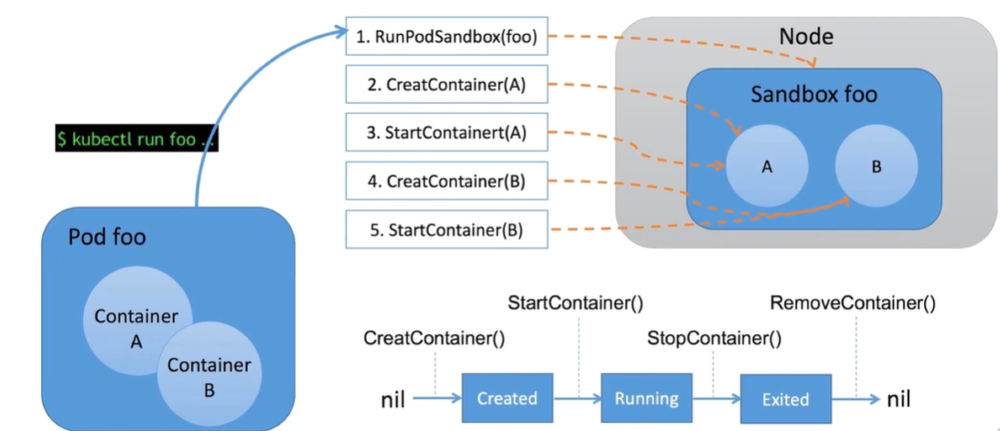
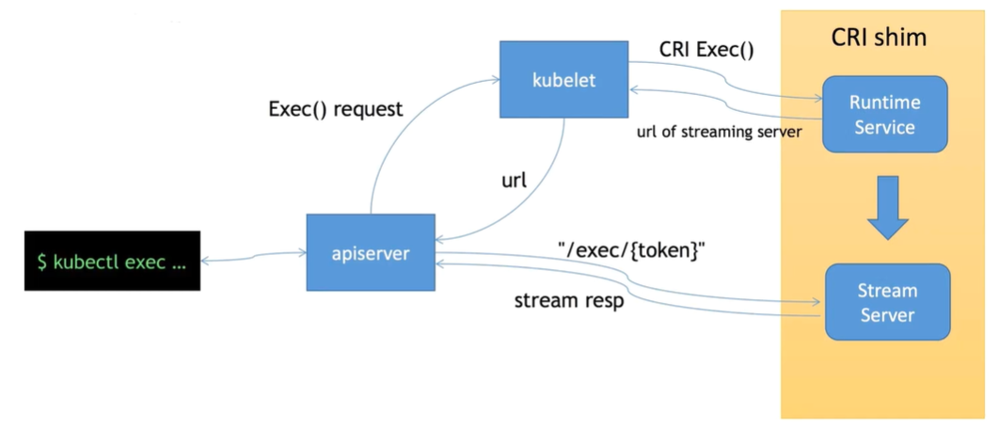

# 容器运行时接口(CRI)

> Kubernetes提供了多种容器开放接口用于对接不同的后端来提供资源，如提供计算资源的容器运行时接口（Container Runtime Interface, CRI），提供网络资源的容器网络接口(Container Network Interface, CNI)，提供提供存储资源的容器存储接口（Container Storage Interface, CSI）。

## CRI 由来
在 Kubernetes1.5 之前 Docker 作为第一个容器运行时，Kubelet 通过内嵌 dockershim 操作容器API，但随着越来越多的容器运行时的希望加入kubelet，社区开始有人提出通过[加入一个client/server接口来抽象容器运行时](https://github.com/kubernetes/kubernetes/issues/13768)。在 v1.6.0 后， Kubernetes 开始默认启用 CRI(容器运行时接口)，下图是容器运行时在 kubernets 中得作用。


<center>图1. kubernets操作数据流图</center>


## CRI 架构介绍
*以下主要介绍Kubernetes1.18版的CRI*

CRI 为 kubelet 提供一套抽象的容器调度的接口，CRI 主要承接 kubelet 对容器的操作。CRI 得通信协议是 gRPC，当时主要考虑到性能问题。加入 CRI 后 kubelet 得架构如下图所示。


<center>图2. kubelet 架构</center>

Kubelet 现在主要包含两个运行时的模块，一个是 dockershim, 一个是 remote。dockershim 是原来的提供Docker的运行时接口(PS: docker果然还是一等公民🤭:)。[remote](https://github.com/kubernetes/kubernetes/tree/release-1.18/pkg/kubelet/remote)包对应的就是 CRI 接口，采用gRPC，通过 RemoteRuntime 和 CRI RuntimeService相连：
```
...
// createAndStartFakeRemoteRuntime creates and starts fakeremote.RemoteRuntime.
// It returns the RemoteRuntime, endpoint on success.
// Users should call fakeRuntime.Stop() to cleanup the server.
func createAndStartFakeRemoteRuntime(t *testing.T) (*fakeremote.RemoteRuntime, string) {
	endpoint, err := fakeremote.GenerateEndpoint()
	require.NoError(t, err)

	fakeRuntime := fakeremote.NewFakeRemoteRuntime()
	fakeRuntime.Start(endpoint)

	return fakeRuntime, endpoint
}

func createRemoteRuntimeService(endpoint string, t *testing.T) internalapi.RuntimeService {
	runtimeService, err := NewRemoteRuntimeService(endpoint, defaultConnectionTimeout)
	require.NoError(t, err)

	return runtimeService
}

func TestVersion(t *testing.T) {
	fakeRuntime, endpoint := createAndStartFakeRemoteRuntime(t)
	defer fakeRuntime.Stop()

	r := createRemoteRuntimeService(endpoint, t)
	version, err := r.Version(apitest.FakeVersion)
	assert.NoError(t, err)
	assert.Equal(t, apitest.FakeVersion, version.Version)
	assert.Equal(t, apitest.FakeRuntimeName, version.RuntimeName)
}
```

### CRI 容器运行时的三类行为

CRI 容器运行时主要描述了三种服务的行为 Sandbox、Container、Image：

<center>图3. CRI容器运行时流程</center>

Sandbox:
```
// PodSandboxManager contains methods for operating on PodSandboxes. The methods
// are thread-safe.
type PodSandboxManager interface {
	// RunPodSandbox creates and starts a pod-level sandbox. Runtimes should ensure
	// the sandbox is in ready state.
	RunPodSandbox(config *runtimeapi.PodSandboxConfig, runtimeHandler string) (string, error)
	// StopPodSandbox stops the sandbox. If there are any running containers in the
	// sandbox, they should be force terminated.
	StopPodSandbox(podSandboxID string) error
	// RemovePodSandbox removes the sandbox. If there are running containers in the
	// sandbox, they should be forcibly removed.
	RemovePodSandbox(podSandboxID string) error
	// PodSandboxStatus returns the Status of the PodSandbox.
	PodSandboxStatus(podSandboxID string) (*runtimeapi.PodSandboxStatus, error)
	// ListPodSandbox returns a list of Sandbox.
	ListPodSandbox(filter *runtimeapi.PodSandboxFilter) ([]*runtimeapi.PodSandbox, error)
	// PortForward prepares a streaming endpoint to forward ports from a PodSandbox, and returns the address.
	PortForward(*runtimeapi.PortForwardRequest) (*runtimeapi.PortForwardResponse, error)
}
```

Container:
```
// ContainerManager contains methods to manipulate containers managed by a
// container runtime. The methods are thread-safe.
type ContainerManager interface {
	// CreateContainer creates a new container in specified PodSandbox.
	CreateContainer(podSandboxID string, config *runtimeapi.ContainerConfig, sandboxConfig *runtimeapi.PodSandboxConfig) (string, error)
	// StartContainer starts the container.
	StartContainer(containerID string) error
	// StopContainer stops a running container with a grace period (i.e., timeout).
	StopContainer(containerID string, timeout int64) error
	// RemoveContainer removes the container.
	RemoveContainer(containerID string) error
	// ListContainers lists all containers by filters.
	ListContainers(filter *runtimeapi.ContainerFilter) ([]*runtimeapi.Container, error)
	// ContainerStatus returns the status of the container.
	ContainerStatus(containerID string) (*runtimeapi.ContainerStatus, error)
	// UpdateContainerResources updates the cgroup resources for the container.
	UpdateContainerResources(containerID string, resources *runtimeapi.LinuxContainerResources) error
	// ExecSync executes a command in the container, and returns the stdout output.
	// If command exits with a non-zero exit code, an error is returned.
	ExecSync(containerID string, cmd []string, timeout time.Duration) (stdout []byte, stderr []byte, err error)
	// Exec prepares a streaming endpoint to execute a command in the container, and returns the address.
	Exec(*runtimeapi.ExecRequest) (*runtimeapi.ExecResponse, error)
	// Attach prepares a streaming endpoint to attach to a running container, and returns the address.
	Attach(req *runtimeapi.AttachRequest) (*runtimeapi.AttachResponse, error)
	// ReopenContainerLog asks runtime to reopen the stdout/stderr log file
	// for the container. If it returns error, new container log file MUST NOT
	// be created.
	ReopenContainerLog(ContainerID string) error
}
```

Image:
```
// ImageManagerService interface should be implemented by a container image
// manager.
// The methods should be thread-safe.
type ImageManagerService interface {
	// ListImages lists the existing images.
	ListImages(filter *runtimeapi.ImageFilter) ([]*runtimeapi.Image, error)
	// ImageStatus returns the status of the image.
	ImageStatus(image *runtimeapi.ImageSpec) (*runtimeapi.Image, error)
	// PullImage pulls an image with the authentication config.
	PullImage(image *runtimeapi.ImageSpec, auth *runtimeapi.AuthConfig, podSandboxConfig *runtimeapi.PodSandboxConfig) (string, error)
	// RemoveImage removes the image.
	RemoveImage(image *runtimeapi.ImageSpec) error
	// ImageFsInfo returns information of the filesystem that is used to store images.
	ImageFsInfo() ([]*runtimeapi.FilesystemUsage, error)
}
```

### CRI 容器生命周期操作流程

kubelet创建一个Pod主要可以拆解成：
1. 调用`RunPodSandox`创建一个pod沙盒
2. 调用`CreateContainer`创建一个容器
3. 调用`StartContainer`启动一个容器


<center>图4. 容器生命周期操作流程</center>

### CRI Streaming接口

streaming接口主要是用于执行 `exec` 命令，`exec` 命令主要用于 attach 容器进行交互，通过流式接口的可以节省资源，提高连接的可靠性。
kubelet 调用 `Exec()` 接口发给 RuntimeService ，RuntimeService 返回一个 url 给到 apiserver， 让 apiserver 跟 Stream Server 直接建立连接，获取流式数据。 由于绕过了kubelet，因此Stream Server 也提高连接的可靠性
CRI 中 `Exec()` 接口：
```
// ContainerManager contains methods to manipulate containers managed by a
// container runtime. The methods are thread-safe.
type ContainerManager interface {
    ...
	// Exec prepares a streaming endpoint to execute a command in the container, and returns the address.
	Exec(*runtimeapi.ExecRequest) (*runtimeapi.ExecResponse, error)
	// Attach prepares a streaming endpoint to attach to a running container, and returns the address.
	Attach(req *runtimeapi.AttachRequest) (*runtimeapi.AttachResponse, error)
    ...
}
```


<center>图5. streaming数据流</center>


## CRI proto接口定义

CRI 是一个为kubelet提供的一个广泛的容器运行时的无需编译的接口插件。 CRI 包含了一个 protocol buffers 和 gRPC API。kubernetes1.18的 CRI 代码路径：[`kubernetes/staging/src/k8s.io/cri-api/`](https://github.com/kubernetes/kubernetes/tree/release-1.18/staging/src/k8s.io/cri-api)。
CRI中定义了容器和镜像的服务的接口，因为容器运行时与镜像的生命周期是彼此隔离的，因此需要定义两个服务 RuntimeService 和 ImageService。

RuntimeService的proto接口定义文件
```
// Runtime service defines the public APIs for remote container runtimes
service RuntimeService {
    // Version returns the runtime name, runtime version, and runtime API version.
    rpc Version(VersionRequest) returns (VersionResponse) {}

    // RunPodSandbox creates and starts a pod-level sandbox. Runtimes must ensure
    // the sandbox is in the ready state on success.
    rpc RunPodSandbox(RunPodSandboxRequest) returns (RunPodSandboxResponse) {}
    // StopPodSandbox stops any running process that is part of the sandbox and
    // reclaims network resources (e.g., IP addresses) allocated to the sandbox.
    // If there are any running containers in the sandbox, they must be forcibly
    // terminated.
    // This call is idempotent, and must not return an error if all relevant
    // resources have already been reclaimed. kubelet will call StopPodSandbox
    // at least once before calling RemovePodSandbox. It will also attempt to
    // reclaim resources eagerly, as soon as a sandbox is not needed. Hence,
    // multiple StopPodSandbox calls are expected.
    rpc StopPodSandbox(StopPodSandboxRequest) returns (StopPodSandboxResponse) {}
    // RemovePodSandbox removes the sandbox. If there are any running containers
    // in the sandbox, they must be forcibly terminated and removed.
    // This call is idempotent, and must not return an error if the sandbox has
    // already been removed.
    rpc RemovePodSandbox(RemovePodSandboxRequest) returns (RemovePodSandboxResponse) {}
    // PodSandboxStatus returns the status of the PodSandbox. If the PodSandbox is not
    // present, returns an error.
    rpc PodSandboxStatus(PodSandboxStatusRequest) returns (PodSandboxStatusResponse) {}
    // ListPodSandbox returns a list of PodSandboxes.
    rpc ListPodSandbox(ListPodSandboxRequest) returns (ListPodSandboxResponse) {}

    // CreateContainer creates a new container in specified PodSandbox
    rpc CreateContainer(CreateContainerRequest) returns (CreateContainerResponse) {}
    // StartContainer starts the container.
    rpc StartContainer(StartContainerRequest) returns (StartContainerResponse) {}
    // StopContainer stops a running container with a grace period (i.e., timeout).
    // This call is idempotent, and must not return an error if the container has
    // already been stopped.
    // TODO: what must the runtime do after the grace period is reached?
    rpc StopContainer(StopContainerRequest) returns (StopContainerResponse) {}
    // RemoveContainer removes the container. If the container is running, the
    // container must be forcibly removed.
    // This call is idempotent, and must not return an error if the container has
    // already been removed.
    rpc RemoveContainer(RemoveContainerRequest) returns (RemoveContainerResponse) {}
    // ListContainers lists all containers by filters.
    rpc ListContainers(ListContainersRequest) returns (ListContainersResponse) {}
    // ContainerStatus returns status of the container. If the container is not
    // present, returns an error.
    rpc ContainerStatus(ContainerStatusRequest) returns (ContainerStatusResponse) {}
    // UpdateContainerResources updates ContainerConfig of the container.
    rpc UpdateContainerResources(UpdateContainerResourcesRequest) returns (UpdateContainerResourcesResponse) {}
    // ReopenContainerLog asks runtime to reopen the stdout/stderr log file
    // for the container. This is often called after the log file has been
    // rotated. If the container is not running, container runtime can choose
    // to either create a new log file and return nil, or return an error.
    // Once it returns error, new container log file MUST NOT be created.
    rpc ReopenContainerLog(ReopenContainerLogRequest) returns (ReopenContainerLogResponse) {}

    // ExecSync runs a command in a container synchronously.
    rpc ExecSync(ExecSyncRequest) returns (ExecSyncResponse) {}
    // Exec prepares a streaming endpoint to execute a command in the container.
    rpc Exec(ExecRequest) returns (ExecResponse) {}
    // Attach prepares a streaming endpoint to attach to a running container.
    rpc Attach(AttachRequest) returns (AttachResponse) {}
    // PortForward prepares a streaming endpoint to forward ports from a PodSandbox.
    rpc PortForward(PortForwardRequest) returns (PortForwardResponse) {}

    // ContainerStats returns stats of the container. If the container does not
    // exist, the call returns an error.
    rpc ContainerStats(ContainerStatsRequest) returns (ContainerStatsResponse) {}
    // ListContainerStats returns stats of all running containers.
    rpc ListContainerStats(ListContainerStatsRequest) returns (ListContainerStatsResponse) {}

    // UpdateRuntimeConfig updates the runtime configuration based on the given request.
    rpc UpdateRuntimeConfig(UpdateRuntimeConfigRequest) returns (UpdateRuntimeConfigResponse) {}

    // Status returns the status of the runtime.
    rpc Status(StatusRequest) returns (StatusResponse) {}
}
```

ImageService 的 proto 接口定义文件：
```
// ImageService defines the public APIs for managing images.
service ImageService {
    // ListImages lists existing images.
    rpc ListImages(ListImagesRequest) returns (ListImagesResponse) {}
    // ImageStatus returns the status of the image. If the image is not
    // present, returns a response with ImageStatusResponse.Image set to
    // nil.
    rpc ImageStatus(ImageStatusRequest) returns (ImageStatusResponse) {}
    // PullImage pulls an image with authentication config.
    rpc PullImage(PullImageRequest) returns (PullImageResponse) {}
    // RemoveImage removes the image.
    // This call is idempotent, and must not return an error if the image has
    // already been removed.
    rpc RemoveImage(RemoveImageRequest) returns (RemoveImageResponse) {}
    // ImageFSInfo returns information of the filesystem that is used to store images.
    rpc ImageFsInfo(ImageFsInfoRequest) returns (ImageFsInfoResponse) {}
}
```

## CRI工具介绍

- CRI命令工具:crictl，帮助用户和开发者调试容器问题
- CRI测试工具：critest，用于验证CRI接口的测试工具，验证是否满足Kubelet要求。

crictl 安装：
```
VERSION="v1.17.0"
wget https://github.com/kubernetes-sigs/cri-tools/releases/download/$VERSION/crictl-$VERSION-linux-amd64.tar.gz
sudo tar zxvf crictl-$VERSION-linux-amd64.tar.gz -C /usr/local/bin
rm -f crictl-$VERSION-linux-amd64.tar.gz
```

critest 安装：
```
VERSION="v1.17.0"
wget https://github.com/kubernetes-sigs/cri-tools/releases/download/$VERSION/critest-$VERSION-linux-amd64.tar.gz
sudo tar zxvf critest-$VERSION-linux-amd64.tar.gz -C /usr/local/bin
rm -f critest-$VERSION-linux-amd64.tar.gz
```


## 参考文献

- [Introducing Container Runtime Interface (CRI) in Kubernetes](https://kubernetes.io/blog/2016/12/container-runtime-interface-cri-in-kubernetes/): https://kubernetes.io/blog/2016/12/container-runtime-interface-cri-in-kubernetes/
- [CNCF x Alibaba 云原生技术公开课](https://edu.aliyun.com/lesson_1651_17239): https://edu.aliyun.com/lesson_1651_17239
- [cri-tools](https://github.com/kubernetes-sigs/cri-tools): https://github.com/kubernetes-sigs/cri-tools