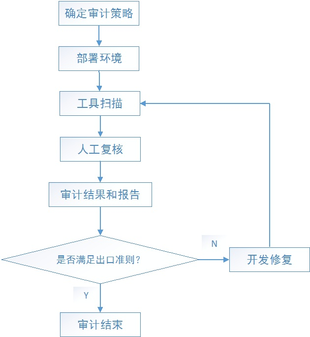

# 代码审计规范

## 目标和原则
- 提高代码质量，及早发现潜在缺陷，降低修改/弥补缺陷的成本
- 促进团队内部知识共享，提高团队整体水平
- 评审过程对于评审人员来说，也是一种思路重构的过程，帮助更多的人理解系统
- 是一个传递知识的手段，可以让其它并不熟悉代码的人知道作者的意图和想法，从而可以在以后轻松维护代码
- 可以被用来确认自己的设计和实现是一个清楚和简单的
- 鼓励相互学习对方的长处和优点
- 高效迅速完成Code Review

## 如何做好code review

### 选定工具
可以用来做Code Review的工具很多，这里主要介绍相对主流的Gerrit、GitLab
- Gerrit
```
Gerrit是Google开源的代码审查工具，Gerrit也是一个基于Git构建的版本管理工具，Gerrit支持将其他Git仓库的代码跟Gerrit自己的仓库做同步。所有的代码审查的操作以及权限控制都是在Gerrit自己的仓库上进行的。

Gerrit是面向代码审查来构建的，所以在代码审查的权限控制，以及功能上都是非常完善的。

Gerrit是可以强制CodeReview的，支持Develop、Reviewer、Approver三种角色支持对每个Project配置不同的CodeReview的人员以及权限。

如果要根据Gerrit的数据做一些统计报表，就直接访问Gerrit的数据库，如果功能上不满足要求，反正是开源的，有Java研发团队就可以自己定制

总之，Gerrit的Code Review功能是非常完善的，缺点可能就是UI、交互太老了以及平台的管理功能较弱。
```
- GitLab家族
```
GitLab是基于Git构建的源代码管理系统，基于GitLab构建的 GitLab.com 是仅次于 GitHub.com 的在线源代码管理平台。

GitLab分GitLab CE（社区版）和 GitLab EE（企业版）两个版本，开源的社区版功能相对会弱一点，但是免费使用，可以自由部署、定制、维护。企业版功能强大，但是需要收费的。

GitLab可以通过MergeRequest来Review代码，也可以做到强制CodeReview，社区版支持Develop、Reviewer两种角色，企业版支持Develop、Reviewer、Approver三种角色，可以给给项目/组分配不同的角色(Master、Developer)来控制Merge代码的权限。

如果需要根据GitLab的数据做一些统计报表，GitLab提供了非常友好的restful API，如果要定制化，建议是通过API来做定制化的工具，不受编程语言限制。

GitLab的Code Review的功能没有Gerrit功能完善，但是GitLab附带的文档功能、以及GitLab完善的管理后台都要比Gerrit更好，如果要做CI/CD，GitLab的社区版几乎是最佳选择
```
- Gerrit VS GitLab 综合对比

| 工具 | 权限控制 | UI 交互 |源代码管理|可维护|数据统计|工具配套|
| :------:| :------: | :------: |:------:|:------:|:------:|:------:
| Gerrit | ⭐ ⭐ ⭐ ⭐ ⭐ | ⭐ ⭐ |⭐ ⭐ ⭐|⭐ ⭐|⭐ ⭐ ⭐ ⭐|⭐ ⭐|
| GitLab社区版 | ⭐ ⭐ ⭐ | ⭐ ⭐ ⭐ ⭐ ⭐ |⭐ ⭐ ⭐ ⭐ ⭐|⭐ ⭐ ⭐ ⭐ ⭐|⭐ ⭐ ⭐ ⭐ ⭐|⭐ ⭐ ⭐ ⭐ ⭐|
| GitLab企业版 | ⭐ ⭐ ⭐ ⭐|⭐ ⭐ ⭐ ⭐ ⭐|⭐ ⭐ ⭐ ⭐ ⭐|⭐ ⭐ ⭐ ⭐ ⭐|⭐ ⭐ ⭐ ⭐ ⭐|⭐ ⭐ ⭐ ⭐|

```
Gerrit强项只有Code Review的控制，GitLab的功能更全面，但GitLab的企业版是收费的。所以，综合来说，更推荐GitLab社区版。
基于GitLab的CodeReview教程：https://ken.io/note/gitlab-code-review-tutorial
```

### 制定开发规范
没有规则，就没有执行。规则中首当其冲的就是开发规范。
规范中建议包含：
- 工程规范（工程结构，分层方式及命名等等）
- 命名规范（接口、类、方法名、变量名等）
- 代码格式（括号、空格、换行、缩进等）
- 注释规范（规定必要的注释）
- 日志规范（合理的记录必要的日志）
- 各种推荐与不推荐的代码示例
### 制定流程规范
- 确定Code Review实施环节

```
CodeReview建议是放在代码提交测试前，也就是开发人员完成代码开发及自测后将代码提交到测试分支时进行Code Review。毕竟，如果测试通过后再进行Code Review，如果需要代码变更，势必会增加测试的工作量，甚至影响项目进度。

以通用的Git Workflow来说，那就是把Code Review放在Feature分支合并到Develop分支时了。
```
- 制定角色行为规范

| 角色 | 规则 |  
| :------:| :------ |
| Developer | 1、一次提交的功能必须是完整的 <br>2、默认细粒度提交（以独立的方法/功能/模块为单位）。如需粗粒度提交，需提前跟Reviewer沟通确认 <br>3、Commit Message中要清晰描述变更的主题 必要时，可以以链接或者文件的形式附上需求文档/设计文档 |
| Reviewer | 1、不允许自我Review并Merge代码 <br>2、Review不通过打回前需跟Developer说明原因并达成一致 <br>3、Review不通过需明确填写打回的原因 <br>4、单次Review时长需控制在2分钟~2小时内完成（特殊情况请说明原因） |
| Approver|1、审批不通过需注明原因 <br>2、审批时长需要控制在1小时以内 <br>3、对于放行的非质量问题，需持续跟进|
```
目的是为了：
```
  - 控制提交Code Review的代码的粒度
  - 控制单次Code Review的时间
  - 提升Commit/MergeRequest描述的质量，减少沟通成本
```
这样，我们就可以通过细粒度高频次的方式尽可能利用工程师碎片化的时间进行Code Review，一定程度上保证Code Review的效率。
```

### 分享与统计
- 定期分享
```
CodeReview的目的是为了互相学习，那么在这个过程中学到的知识，定期的分享出来，既可以加强知识的流动，又可以检查大家究竟有没有在Code Review过程中学习到知识，或者有没有认真的进行Code Review。
至于分享的内容，可以是开发规范中的范例代码，也可以是规范中的正例代码，也可以是针对某个功能实现的最佳算法/最佳实践，也可以是Code Review过程中的争议代码，也可以是自己踩过的坑。
总之，Code Review之后的代码分享，不但可以加强知识的流动，还可以检验Code Review的效果。
```
- 数据统计
  - 每人每周Code Review所消耗的时间
  - 每人每周被Code Review所消耗的平均时间
  - 超过规定时间的Code Review情况
  - 代码提交描述字数过少的情况
  - 等等（根据自己的需要来）
```
通过以上的数据，可以让Code Review的情况直观的展示出来。来发现大家执行过程中需要优化的事项，不断帮助大家完善规则，做好执行。
```
## 代码安全性审计

- 确定审计策略，审计策略主要考虑的是代码开发语言、架构、安全审计质量准则或出口准则、检测效率等；安全审计质量准则/出口准则需要考虑检测工具是否能够满足对检测质量要求，也就是对于检测项的覆盖，同时工具应该具有弹性扩展。
- 部署环境，主要考虑代码审计工具能够适合公司所有的物理环境，包括网络、服务器、工具兼容性等；
- 工具扫描，主要考虑代码工具的技术指标，例如工具支持的开发语言、检测精度、效率，是否支持迭检测、CI模式下检测等；
- 人工复核，主要考虑人工复核的工作量，检测结果是否容易复核。这就要求检测工具精度高、结果容易检查、误报少；
- 审计结果和报告，主要考虑的是根据需要是否能够自动产生审计结果、审计报告，报告能够根据需要求孽缘定制；检测结果和报告，中文显示，便于阅读。检测过程能够跟踪，回溯。
- 出口准则，能够根据代码审计需要制定审计范围、选择审计安全漏洞的严重程度级别。检测完成，能够判断是否满足选择的出口准则，便于快速决策。
- 开发修复，主要考虑检测结果是否便于开发人员修复、安全漏洞能够快速定位、提示信息准确、甚至能够自动进行修复或给出修复检查代码。检测精度高，误报少，漏报少，这就要求检测工具比较成熟，且得到国际公认组织的认证、认可，符合国际、国内主流标准。同时，对于开发团队确认和修复代码可以提供培训和支持。
