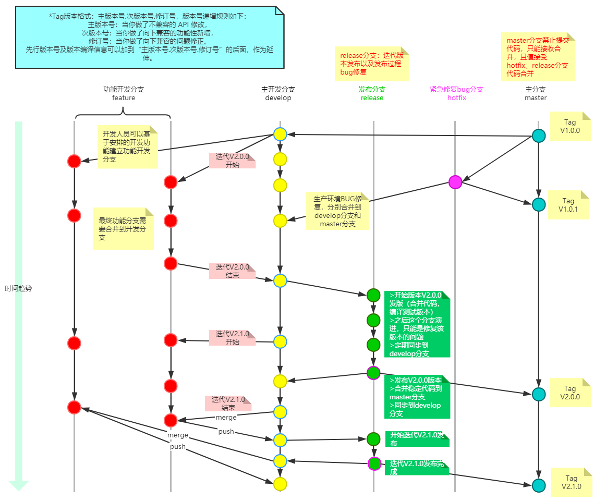

# 代码管理规范

## 分支管理

通常每个应用或者是二方库的代码将包括 master、develop、release、hotfix、feature分支，release、hotfix 分支的命名规则分别为：release-*，hotfix-*。feature分支的命名可以使用除master，develop，release-*，hotfix-*之外的任何名称。

各分支使用办法说明如下：
- master分支
    ```
    master和develop分支都是主分支，主分支是所有开发活动的核心分支。所有的开发活动产生的输出物最终都会反映到主分支的代码中。

    master分支上存放的应该是随时可供在生产环境中部署的代码（Production Ready state）。当开发活动告一段落，产生了一份新的可供部署的代码时，master分支上的代码会被更新。同时，每一次更新，都有对应的版本号标签（TAG）。
    ```
- develop分支
    ```
    develop分支是保存当前最新开发成果的分支。通常这个分支上的代码也是可进行每日夜间发布的代码（Nightly build）。因此这个分支有时也可以被称作“integration branch”。

    当develop分支上的代码已实现了软件需求说明书中所有的功能，通过了所有的测试后，并且代码已经足够稳定时，就可以将所有的开发成果合并回master分支了。对于master分支上的新提交的代码建议都打上一个新的版本号标签（TAG），供后续代码跟踪使用。
    ```
- release分支
  - 可以从develop分支派生
  - 必须合并回develop分支和master分支
  - 分支命名惯例：release-*
  ```
    release分支是为发布新的产品版本而设计的。在这个分支上的代码允许做小的缺陷修正、准备发布版本所需的各项说明信息（版本号、发布时间、编译时间等等）。通过在release分支上进行这些工作可以让develop分支空闲出来以接受新的feature分支上的代码提交，进入新的软件开发迭代周期。

    当develop分支上的代码已经包含了所有即将发布的版本中所计划包含的软件功能，并且已通过所有测试时，我们就可以考虑准备创建release分支了。而所有在当前即将发布的版本之外的业务需求一定要确保不能混到release分支之内（避免由此引入一些不可控的系统缺陷）。

    成功的派生了release分支，并被赋予版本号之后，develop分支就可以为“下一个版本”服务了。所谓的“下一个版本”是在当前即将发布的版本之后发布的版本。版本号的命名可以依据项目定义的版本号命名规则进行。
  ```
- hotfix分支
  - 可以从master分支派生
  - 必须合并回master分支和develop分支
  - 分支命名惯例：hotfix-*
  ```
    除了是计划外创建的以外，hotfix分支与release分支十分相似：都可以产生一个新的可供在生产环境部署的软件版本。当生产环境中的软件遇到了异常情况或者发现了严重到必须立即修复的软件缺陷的时候，就需要从master分支上指定的TAG版本派生hotfix分支来组织代码的紧急修复工作。
  ```
- feature分支
    - 可以从develop分支发起feature分支
    - 代码必须合并回develop分支
    - feature分支的命名可以使用除master，develop，release-*，hotfix-*之外的任何名称
    ```
    feature分支（有时也可以被叫做“topic分支”）通常是在开发一项新的软件功能的时候使用，这个分支上的代码变更最终合并回develop分支或者干脆被抛弃掉（例如实验性且效果不好的代码变更）。

    一般而言，feature分支代码可以保存在开发者自己的代码库中而不强制提交到主代码库里。
    ```
## 提交规范
>在团队协作开发时，制定统一标准，有助力于促使团队形成一致的代码提交风格，更好的提高工作效率，有利于阅读和维护。
###  格式
```
type: description
```
1. type 类型
    ```
    type 是 commit 的类别，只允许如下几种标识：
    ```
    - fix: 修复bug
    - add: 新功能
    - update: 更新
    - style : 代码格式改变
    - test: 增加测试代码
    - revert: 撤销上一次的commit
    - build: 构建工具或构建过程等的变动，如：gulp 换成了 webpack，webpack 升级等
2. description
    ```
    description 是对本次提交的简短描述，建议不超过50个字符。推荐以动词开头，如： 设置、修改、增加、删减、撤销等
    ```
### CI/CD规范
