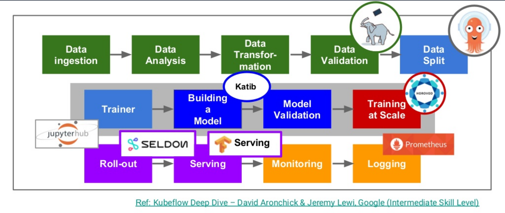
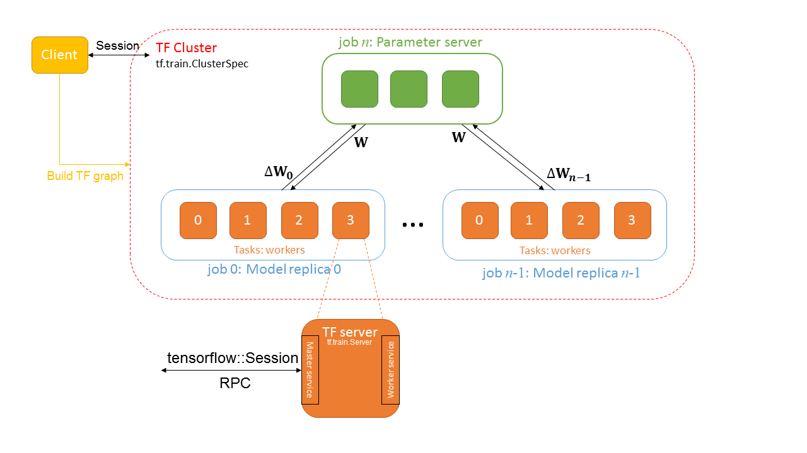
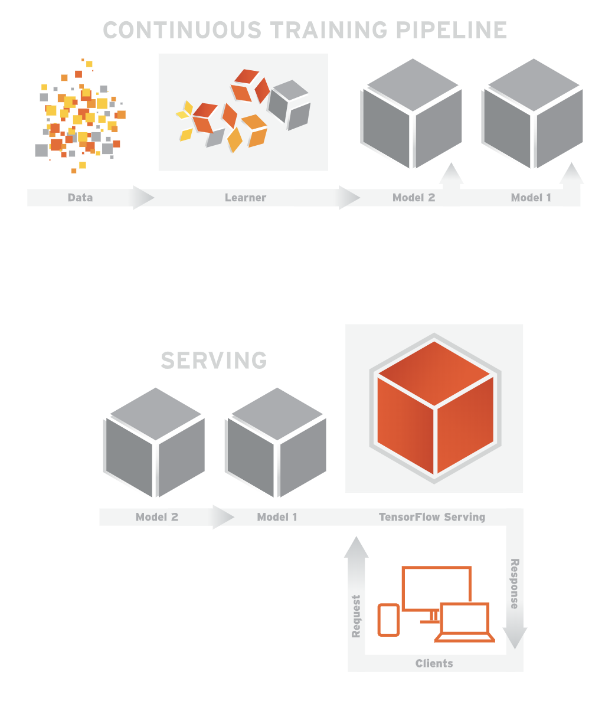

# kubeflow核心组件


> kubeflow作为基于云原生的机器学习大礼包，即可以作为一个很好的云原生的学习例子，同时基于k8s的生态必将是未来的发展的方向，相信后续Mxnet、paddle等各类型技术框架也都会运行在kubernetes这个生态之上。


为了对kubeflow有个更直观深入的了解，对kubeflow的各组件进行简单的介绍，先从机器学习任务来看kubeflow的的实现。

## 机器学习任务工程化实现流程

一个建模任务下来主要可以分为四大块任务

- 业务理解(Business Understanding)
- 数据获取及数据理解(Data Acquistition)
- 特征处理(Feature Engineering)、建模与模型训练(Model Training)、模型评估(Model Evaluation)
- 模型部署(Deployment)，提供模型服务


一个机器学习任务从开始到结束主要分为了四大任务，Kubeflow的各项功能可以说就是围绕这四项任务构建的。

## kubeflow

kubeflow 最开始基于tf-operator，后来随着项目发展最后变成一个基于云原生构建的机器学习任务工具大集合。从数据采集，验证，到模型训练和服务发布，几乎所有步骤的小组件 Kubeflow 都提供解决方案的组件：



kubeflow特点：
- 基于k8s，具有云原生的特性：弹性伸缩、高可用、DevOps等
- 集成大量机器学习所用到的工具

### 结构

kubeflow的完整结构可以看他的kustomize安装文件：
```
kustomize/
├── ambassador.yaml
├── api-service.yaml
├── argo.yaml
├── centraldashboard.yaml
├── jupyter-web-app.yaml
├── katib.yaml
├── metacontroller.yaml
├── minio.yaml
├── mysql.yaml
├── notebook-controller.yaml
├── persistent-agent.yaml
├── pipelines-runner.yaml
├── pipelines-ui.yaml
├── pipelines-viewer.yaml
├── pytorch-operator.yaml
├── scheduledworkflow.yaml
├── tensorboard.yaml
└── tf-job-operator.yaml
```

`ambassador` 微服务网关
`argo` 用于任务工作流编排
`centraldashboard` kubeflow的dashboard看板页面
`tf-job-operator` 深度学习框架引擎，一个基于tensorflow构建的CRD，[资源类型kind为TFJob](#TFJob)
`tensorboard` tensorflow的训练可视化UI界面
`katib` 超参数服务器
`pipeline` 一个机器学习的工作流组件
`jupyter` 一个交互式业务IDE编码环境


## TFJob



TFJob 是将 tensorflow 的分布式架构基于 k8s 构建的一种CRD：
- **Chief**  负责协调训练任务
- **Ps** 参数服务器，为模型的参数提供分布式的数据存储
- **Worker** 负责实际训练模型的任务. 在某些情况下 worker 0 可以充当Chief的责任。
- **Evaluator** 负责在训练过程中进行性能评估


```
apiVersion: kubeflow.org/v1beta2
kind: TFJob
metadata:
  name: mnist-train
  namespace: kubeflow
spec:
  tfReplicaSpecs:
    Chief: # 调度器
      replicas: 1
      template:
        spec:
          containers:
            - command:
              - /usr/bin/python
              - /opt/model.py
              env:
              - name: modelDir
                value: /mnt
              - name: exportDir
                value: /mnt/export
              image: mnist-test:v0.1
              name: tensorflow
              volumeMounts:
              - mountPath: /mnt
                name: local-storage
              workingDir: /opt
            restartPolicy: OnFailure
            volumes:
            - name: local-storage
              persistentVolumeClaim:
                claimName: local-path-pvc
    Ps: # 参数服务器
      replicas: 1
      template:
        spec:
          containers:
            - command:
              - /usr/bin/python
              - /opt/model.py
              env:
              - name: modelDir
                value: /mnt
              - name: exportDir
                value: /mnt/export
              image: mnist-test:v0.1
              name: tensorflow
              volumeMounts:
              - mountPath: /mnt
                name: local-storage
              workingDir: /opt
            restartPolicy: OnFailure
            volumes:
            - name: local-storage
              persistentVolumeClaim:
                claimName: local-path-pvc
    Worker: # 计算节点
      replicas: 2
      template:
        spec:
          containers:
            - command:
              - /usr/bin/python
              - /opt/model.py
              env:
              - name: modelDir
                value: /mnt
              - name: exportDir
                value: /mnt/export
              image: mnist-test:v0.1
              name: tensorflow
              volumeMounts:
              - mountPath: /mnt
                name: local-storage
              workingDir: /opt
            restartPolicy: OnFailure
            volumes:
            - name: local-storage
              persistentVolumeClaim:
                claimName: local-path-pvc

```

## tensorboard 训练可视化界面

挂载日志文件，创建 tensorboard 可视化服务

```
apiVersion: v1
kind: Service
metadata:
  name: tensorboard-tb
  namespace: kubeflow
spec:
  ports:
  - name: http
    port: 8080
    targetPort: 80
  selector:
    app: tensorboard
    tb-job: tensorboard
---
apiVersion: apps/v1beta1
kind: Deployment
metadata:
  name: tensorboard-tb
  namespace: kubeflow
spec:
  replicas: 1
  template:
    metadata:
      labels:
        app: tensorboard
        tb-job: tensorboard
      name: tensorboard
      namespace: kubeflow
    spec:
      containers:
      - command:
        - /usr/local/bin/tensorboard
        - --logdir=/mnt
        - --port=80
        env:
        - name: logDir
          value: /mnt
        image: tensorflow/tensorflow:1.11.0
        name: tensorboard
        ports:
        - containerPort: 80
        volumeMounts:
        - mountPath: /mnt
          name: local-storage
      serviceAccount: default-editor
      volumes:
      - name: local-storage
        persistentVolumeClaim:
          claimName: mnist-test-pvc
```

## tf-serving

tenserflow serving 提供一个稳定的接口，供用户调用，来应用该模型，serving 通过模型文件直接创建模型即服务(Model as a service)



```
apiVersion: v1
kind: Service
metadata:
  labels:
    app: mnist
  name: mnist-service-local
  namespace: kubeflow
spec:
  ports:
  - name: grpc-tf-serving
    port: 9000
    targetPort: 9000
  - name: http-tf-serving
    port: 8500
    targetPort: 8500
  selector:
    app: mnist
  type: ClusterIP
---
apiVersion: extensions/v1beta1
kind: Deployment
metadata:
  labels:
    app: mnist
  name: mnist-service-local
  namespace: kubeflow
spec:
  template:
    metadata:
      labels:
        app: mnist
        version: v1
    spec:
      containers:
      - args:
        - --port=9000
        - --rest_api_port=8500
        - --model_name=mnist
        - --model_base_path=/mnt/export
        command:
        - /usr/bin/tensorflow_model_server
        env:
        - name: modelBasePath
          value: /mnt/export
        image: tensorflow/serving:1.11.1
        imagePullPolicy: IfNotPresent
        livenessProbe:
          initialDelaySeconds: 30
          periodSeconds: 30
          tcpSocket:
            port: 9000
        name: mnist
        ports:
        - containerPort: 9000
        - containerPort: 8500
        resources:
          limits:
            cpu: "4"
            memory: 4Gi
          requests:
            cpu: "1"
            memory: 1Gi
        volumeMounts:
        - mountPath: /mnt
          name: local-storage
```

## pipeline

pipeline 是一个可视化的kubeflow任务工作流(Workflow)，定义了一个有向无环图描述的流水线，流水线中每一步流程是由容器定义组成的组件。

运行步骤：
- 先要定义一个Experiment实验
- 然后发起任务，定义一个Pipeline
- 运行Pipeline实例


### 结构介绍


pipeline主要分为八部分：
- Python SDK: 用于创建kubeflow pipeline 的DSL
- DSL compiler: 将Python代码转换成YAML静态配置文件
- Pipeline web server: pipeline的前端服务
- Pipeline Service： pipeline的后端服务
- Kubernetes resources: 创建CRDs运行pipeline
- Machine learning metadata  service: 用于存储任务流容器之间的数据交互（input/output）
- Artifact storage: 用于存储 Metadata 和 Pipeline packages, views
- Orchestration controllers：任务编排，比如Argo Workflow.

### 案例

```
import kfp
from kfp import dsl

def gcs_download_op(url):
    return dsl.ContainerOp(
        name='GCS - Download',
        image='google/cloud-sdk:272.0.0',
        command=['sh', '-c'],
        arguments=['gsutil cat $0 | tee $1', url, '/tmp/results.txt'],
        file_outputs={
            'data': '/tmp/results.txt',
        }
    )


def echo2_op(text1, text2):
    return dsl.ContainerOp(
        name='echo',
        image='library/bash:4.4.23',
        command=['sh', '-c'],
        arguments=['echo "Text 1: $0"; echo "Text 2: $1"', text1, text2]
    )


@dsl.pipeline(
  name='Parallel pipeline',
  description='Download two messages in parallel and prints the concatenated result.'
)
def download_and_join(
    url1='gs://ml-pipeline-playground/shakespeare1.txt',
    url2='gs://ml-pipeline-playground/shakespeare2.txt'
):
    """A three-step pipeline with first two running in parallel."""

    download1_task = gcs_download_op(url1)
    download2_task = gcs_download_op(url2)

    echo_task = echo2_op(download1_task.output, download2_task.output)

if __name__ == '__main__':
    kfp.compiler.Compiler().compile(download_and_join, __file__ + '.yaml')
```


## jupyter-notebook

jupyter 是最大限度的利用交互式的工作，他的主要工作体现利用交互式的操作帮助用户快速理解数据和测试评估模型。

主要包括两个模块`jupyter-web-app` 和 `notebook-controller`, jupyter 架构：


也可以用 jupyterhub 代替jupyter, jupyterhub提供了更多功能， jupyterhub 结构：

