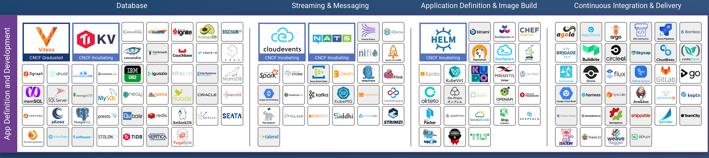
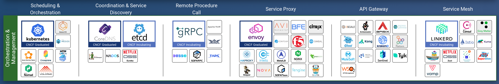
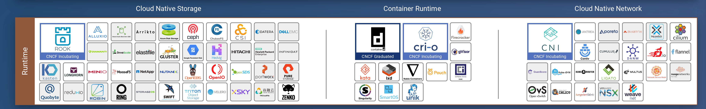
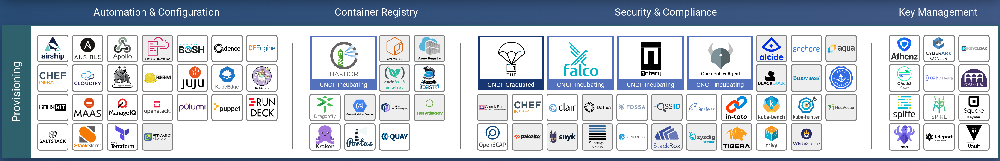
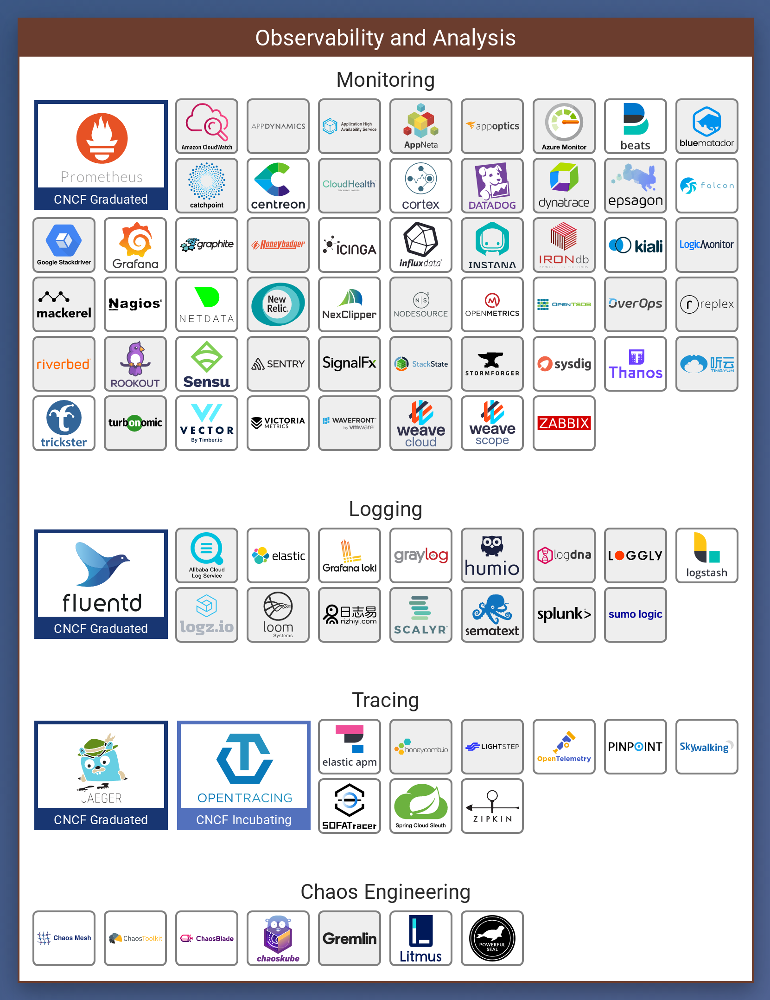
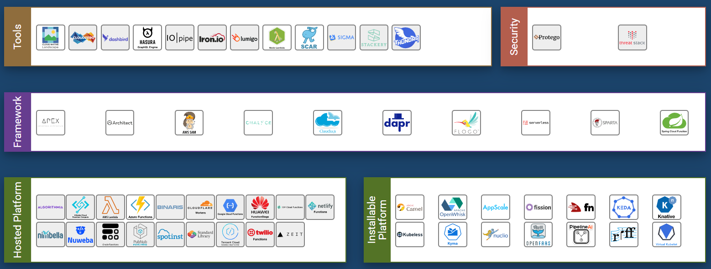
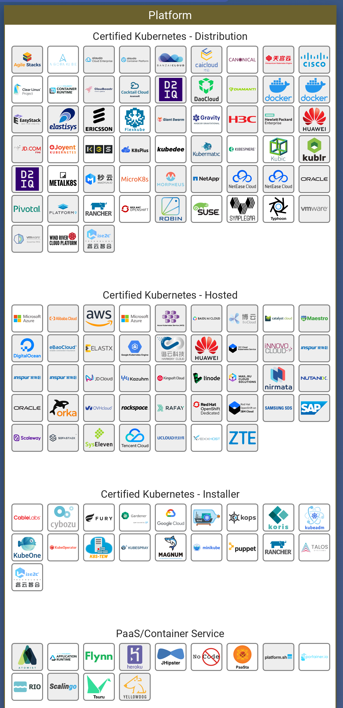

# 云原生的技术范畴

> 云原生虽然真正的提出和推广并算不久，但云原生的生态确十分的繁荣，涉及的技术栈也十分广泛，特别在CNCF基金会成立以后，社区得发展得到了飞速得增长，加上各大云厂商得加入，云原生社区形成1+N的技术生态格局。

## 云原生的生态圈

既然介绍云原生的技术生态体系，这里不得不祭出CNCF的这张landscape。

*这张取自2020/03/02，最新的可见：https://github.com/cncf/landscape*

这里主要分成了几个技术板块，
- 应用定义及部署(App Definition and Development)
- 编排与管理(Orchestration & Management)
- 运行环境(Runtime)
- 配置(Provisioning)
- 平台(Platform)
- 可观测性和分析(Observability and Analysis)
- 无服务(Serverless)

这几大板块基本把云原生技术所涉及领域都涵括进去了，下面详细介绍下各板块所涉及到的技术栈。

从系统层次来看，从上到下分别是：
- 应用层：应用定义及部署(App Definition and Development)、配置(Provisioning)、可观测性和分析(Observability and Analysis)、无服务(Serverless)
- 集群：编排与管理(Orchestration & Management)
- 底层运行环境：运行环境(Runtime)

## 应用定义及部署

这个板块的技术栈主要是应用开发过程种都会用到的，像数据库、流式处理和消息队列、应用定义和镜像构建、持续集成和持续部署。
- **数据库(Database)**：应用层的数据库，其中 PingCAP 公司推出的 TiDB 就是其中的佼佼者之一，其具有水平弹性扩展、分布式事务等特性让其和云原生应用理念天然的契合。
- **流式处理和消息队列(Streaming and Messaging)**：常用的消息队列有kafka、NATS、RabbitMQ等，常用的应用系统中也用的比较多。流式处理有Spark streaming、storm、flink等，都是常用的大数据流式计算框架。
- **应用定义和镜像构建(App Definition and Image Build)**：云原生的应用构建一般由于一堆 YAML 文件组成，为了能更灵活的生成和打包管理这些配置定义文件，我们需要一些工具，而 Helm 就是k8s应用比较多的一种应用程序 Chart 的创建、打包、发布以及创建的软件包管理工具。
- **持续集成与持续部署(Continuous Integration and Continuous Delivery)**：持续集成和持续部署是一种基于敏捷开发提出的开发工具，由于敏捷开发中要求要以快步小走的方式进行迭代，为了节约测试、部署时间周期，必须需要一个能做到和代码管理进行结合的自动化测试和部署工具，而这就是持续集成和部署（简称CI/CD）。常用的CI/CD工具有Jenkins、Travis CI、gitlab runner等。

## 编排与管理

编排与管理板块可以说是云原生的核心，其包括了容器编排、一致性与服务发现、远程程序调用(RPC)、服务代理、API网关、服务网格。
- **容器编排与调度(Orchestration and Scheduling)**：容器的编排和管理可以说是云原生的基石，而 Kubernetes 可以说是这个领域的事实标准，作为 CNCF 基金会的首个毕业项目和金字招牌甚至很多人认为云原生就是 k8s 和其相关的一系列技术，虽然这样的说法是很不准确的，不过现在云原生技术确实和k8s绑定的越来越紧密，由此而衍生了一大批的工具生态。
- **一致性与服务发现(Coordination and Service Discovery)**：各服务之间的协同以及服务发现是分布式计算中的核心，分布式架构作为云原生的基础特性之一可以说是不可或缺的功能组件，从大数据时代的老牌的Zookeeper到到Docker Swarm采用的Consul，再到k8s中集成的分布式键值数据库etcd和DNS服务发现CoreDNS都是其中的佼佼者。
- **远程调用服务(Remote Procedure Call)**：广义上的远程调用一般分为两种，一种基于HTTP协议，一种基于RPC，而狭义的远程调用一般指的RPC。比较常用的RPC框架有 Google 开源的 gRPC和 Apache 旗下的 Thrift 框架，k8s是采用 gRPC 框架作为服务间调用。
- **服务代理(Service Proxy)**：平常用的最多的服务代理应该就是nginx了，作为一个高性能支持正向和方向代理的服务器, nginx具备成熟和广泛的应用场景。envoy 则是一个新生的用go写的服务代理，像Istio、Ambassador的服务代理就是采用了envoy，因此在云原生应用中 envoy 也具备强大的生命力。
- **API网关(API Gateway)**：API网格主要起到对所有的API的调用进行统一接入和管理、认证、授权等功能。ambassador、traefik、kong等都是优秀的微服务网关。
- **服务网格(Service Mesh)**：服务网格是用于控制应用的不同部分之间如何共享数据，服务网格是内置于应用程序中的专用基础架构层，用于记录应用的不同部分是否能正常交互。服务网格可以更细粒度地为每个服务提供限流、管控、熔断、安全等功能。Istio 是最流行的 Service Mesh 之一，其以易用性、无侵入、功能强大赢得众多用户青睐，相信不久将来应该有可能会成为服务网格的事实标准。

## 运行环境

这里的运行时板块指的就是容器运行环境，包括了容器存储、容器计算、容器网络三大工具，在k8s分别对应的是CSI、CRI和CNI三类接口定义。
- **云原生存储(Cloud Native Storage)**：随着数据库、消息队列等中间件逐步在容器环境中得到应用，容器持久化存储的需求也逐步增多，随之而来的是建立一套基于云原生的存储系统，在k8s中对应的就是CSI——容器存储接口。持久化存储中用的比较多的是Ceph，作为一个分布式存储系统，Ceph提供较好的性能、可靠性和可扩展性。
- **容器运行时(Container Runtime)**：容器运行时就是指容器的运行环境，比如最常用的Docker。除了docker,还有一个比较著名的开源容器运行时标准组织（Open Container Initiative），简称OCI。OCI由Linux基金会于2015年6月成立，旨在围绕容器格式和运行时制定一个开放的工业化标准，目前主要有两个标准文档：容器运行时标准 （runtime spec）和 容器镜像标准（image spec），Containerd就是一个满足OCI规范的核心容器运行时。
- **云原生网络(Cloud Native Network)**：容器的网络方案，为容器集群提供一层虚拟化的网络，像k8s的CNI就是其中一个标准的网络接口，flannel是 CoreOS 公司主推的容器网络方案，现在现在比较主流的一种网络之一。

## 配置

配置板块主要包括四个模块自动化与配置、容器注册、安全与合规性、密钥管理。

- **自动化与配置(Automation & Configuration)**：用于自动化部署和配置容器运行平台和环境，代表工具包括Ansible、Chef、Puppet、VMware、OpenStack。
- **容器注册(Container Registry)**：容器注册是整个CNCF云原生中的重要部件，因为基于容器的运行环境中，所有的应用都需要借助容器镜像库来进行安装和部署。容器注册工具主要分公有工具和私有工具，公有的容器镜像库主要包括docker官方的registry，在私有镜像库最著名的是Harbor，目前市面上大量的容器平台目前都基于Harbor构建其镜像仓库。
- **安全与合规性(Security & Compliance)**：安全性和合规性基本是所有系统都会面临的东西，Notary和TUF是这个领域两个主要的项目，其中TUF是一个开源的安全标准，Notary是其中一个实现。
- **密钥管理(Key Management)**：秘钥管理做权限管理和身份认证，比如雅虎发布的athenz，就是一个基于RBAC的权限管理和配置。SPIFFE通用安全身份框架提供了统一的工作负载身份解决方案。

## 可观测性与分析

可观测性与分析板块主要包括了监控、日志、追踪和混沌工程。
- **监控(Monitoring)**：监控主要是对运行系统和应用的状态进行观测与预警，常用的监控有Prometheus、Zabbix等，Grafana通常会配合Prometheus做图形化的展示。
- **日志(Logging)**：日志采集模块，如ELK(elastic/logstash/kibana)、fluentd等。
- **追踪(Tracing)**: 这里的tracing是指分布式链路追踪，因为在分布式系统中，各服务之间相互调用，一个地方出问题可以会导致很多其他服务上的组件出现连锁问题，因此在定位问题的时候十分困难，必须要建立分布式链路追踪来对错误和故障进行定位，分布式跟踪是对日志和监控指标的重要补充。OpenTracing 是一套分布式系统跟踪标准协议，为大家建立一套统一的标准来实现分布式跟踪信息的描述和传递。
- **混沌工程(Chaos Engineering)**：混沌工程主要是解决在高复杂性的分布式系统之上建立起值得信任的生产部署体系，比如服务不可用时后备设置不当 ; 因超时设置不当导致反复重试 ; 下游依赖关系在接收到大量流量时出现中断 ; 发生单点故障时连锁引发后续问题等一系列混乱的难题，建立受控实验观察分布式系统。

## 无服务

Serverless是一个很大的领域，因此针对 serverless 这里专门又细分了五个模块：工具、安全、框架、注册平台和可安装平台。
- **工具(Tools)**：一些工具集，，比如CNCF的landscape作为一个信息聚合网站可以用于查看各种新的软件工具(CNCF永远把自己放第一😂)、Dashbird可以用于serverless监控和故障排查工具。
- **安全(Security)**：主要提供serverless的安全防护。
- **框架(Framework)**：指直接用于构建、管理serverless应用的框架，比如Apex可以用于构建、发布和管理AWS Lambda，SAM 一个Python的开源serverless应用构建框架。
- **注册平台(Hosted Platfrom)**：指提供第三方注册的厂商服务，比如AWS的Lambda、阿里云的函数计算服务、Google的cloud functions服务等。
- **可安装平台(Installable Platform)**：这里就是用于自己搭建serverless平台的工具，比如著名的Knative，就是由谷歌开源的 serverless 架构方案。

## 平台

这些主要是云原生相关的平台供应商，需要找相关的产品和合作可以在这里找。

## 后记

云原生的技术范畴是很广的，可以说所有和分布式系统相关的技术栈基本都包含了，也是云计算最佳实践的集合。